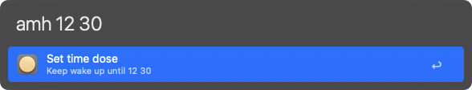

# Amphetamine Dose | Alfred Workflow

A simple workflow that integrates with the [Amphetamine app](https://apps.apple.com/us/app/amphetamine/id937984704?mt=12) to keep your Mac awake. This workflow allows you to activate or deactivate Amphetamine and set it to stay awake for a specified number of minutes, all from within Alfred.

## Install

- Available on the Alfred Gallery. Get it [here](https://alfred.app/workflows/vanstrouble/amphetamine-dose/).
- You can also download it from GitHub [here](https://github.com/vanstrouble/dose-alfred-workflow/releases).

**This workflow is only for Alfred.app Powerpack users.**

## Getting Started

### Turn on Amphetamine (amp on)

Turn on Amphetamine to keep your Mac awake:

**Keyword:** amp on

### Turn off Amphetamine (amp off)

Turn off Amphetamine to stop keeping your Mac awake.

**Keyword:** amp off

### Set Amphetamine to stay awake for a specified number of minutes (ams)

Set Amphetamine to stay awake for a specified number of minutes. Only integer values are allowed.

**Keyword:** ams [number of minutes]

Example:

- `ams 30` will keep your Mac awake for 30 minutes.

### Set Amphetamine to stay awake for a specified number of hours (amh)

Set Amphetamine to stay awake for a specified number of hours. This command supports both whole hours and hours with minutes.

**Keyword:** amh [number of hours] [optional minutes]

Examples:

- `amh 3` will keep your Mac awake for 2 hours.
- `amh 6 30` will keep your Mac awake for 6 hours and 30 minutes.
- `amh 1.5` will keep your Mac awake for 1 hour and 30 minutes.

### Keep your Mac awake until a specific time (amh + Option key)

Set Amphetamine to keep your Mac awake until a specific time. This mode is activated by holding down the Option key while using the amh command.

**Keyword:** amh [target hour] [optional minutes] [optional am/pm]

Examples:

- `amh 12 30` (while holding Option) will keep your Mac awake until 12:30 (AM or PM, inferred from current time).
- `amh 5 pm` (while holding Option) will keep your Mac awake until 5 PM.
- `amh 2 15 am` (while holding Option) will keep your Mac awake until 2:15 AM.

If no AM/PM is provided, the script will infer it based on the current time to avoid confusion. (Only supports the 12-hour format).

---

This workflow provides an easy and flexible way to control Amphetamine directly from Alfred. Enjoy!
