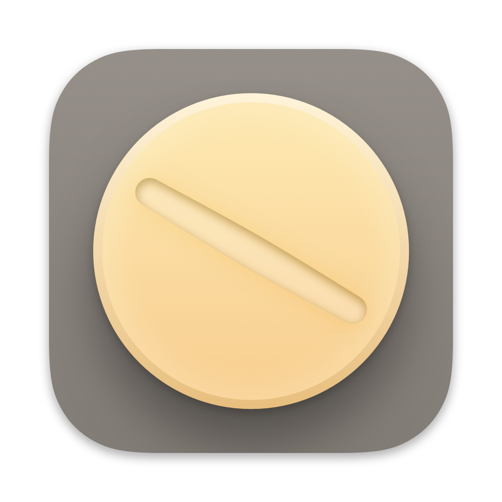
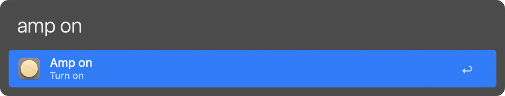
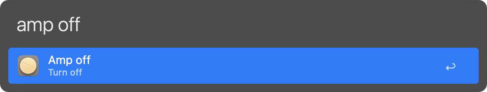
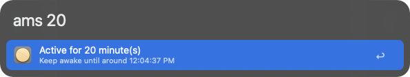

# Amphetamine Dose | Alfred Workflow

A simple workflow that integrates with the [Amphetamine app](https://apps.apple.com/us/app/amphetamine/id937984704?mt=12) to keep your Mac awake. This workflow allows you to activate or deactivate Amphetamine and set it to stay awake for a specified number of minutes, all from within Alfred.

To download it, click [here](https://github.com/vanstrouble/dose-alfred-workflow/releases).

**This workflow is only for Alfred.app Powerpack users.**

## Getting Started

Below you can see a list of commands supported:

### Turn on Amphetamine (amp on)

Turn on Amphetamine to keep your Mac awake:

**Keyword:** amp on

### Turn off Amphetamine (amp off)

Turn off Amphetamine to stop keeping your Mac awake:

**Keyword:** amp off

### Set Amphetamine to stay awake for a specified number of minutes (ams)

Set Amphetamine to stay awake for a specified number of minutes. Only integer values are allowed:

**Keyword:** ams [number of minutes]

Example: `ams 30` will keep your Mac awake for 30 minutes.
