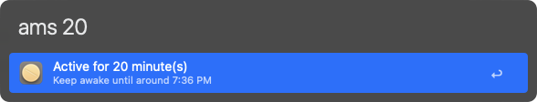

#  Amphetamine Dose | Alfred Workflow

A simple workflow that integrates with the [Amphetamine app](https://apps.apple.com/us/app/amphetamine/id937984704?mt=12) to keep your Mac awake. This workflow allows you to activate or deactivate Amphetamine and set it to stay awake for a specified number of minutes, all from within Alfred.

## Install

- Available on the Alfred Gallery. Get it [here](https://alfred.app/workflows/vanstrouble/amphetamine-dose/).
- You can also download it from GitHub [here](https://github.com/vanstrouble/dose-alfred-workflow/releases).

**This workflow is only for Alfred.app Powerpack users.**

## Getting Started

### keep your Mac awake (dose)

Use the `dose` keyword to toggle Amphetamine on or off, preventing macOS from sleeping.

**Keyword:** `dose`

If you hold the Command key while using the `dose` command, the session will allow the display to sleep.

### One command for everything (ams)

The `ams` command allows you to set Amphetamine to keep your Mac awake for a specific duration or until a specific time. It supports natural input formats for minutes, hours, and specific times, making it flexible and easy to use.

**Keyword:** `ams [duration or time]`

If you hold the Command key while using the `ams` command, the session will allow the display to sleep.

#### Examples:

| Command    | Description                                    |
|------------|------------------------------------------------|
| `ams 15`   | Keeps your Mac awake for 15 minutes.           |
| `ams 1 30` | Keeps your Mac awake for 1 hour and 30 minutes.|
| `ams 2h`   | Keeps your Mac awake for 2 hours.              |
| `ams 8am`  | Keeps your Mac awake until 8:00 AM.            |
| `ams 9:30` | Keeps your Mac awake until the next 9:30.      |
| `ams 11:40am` | Keeps your Mac awake until 11:40 AM.        |

The `ams` command supports both 12-hour (AM/PM) and 24-hour time formats.

This single command replaces the previous `amh` and `amh + Option` commands, simplifying the workflow while adding more flexibility.

---

This workflow provides an easy and flexible way to control Amphetamine directly from Alfred. Enjoy!
