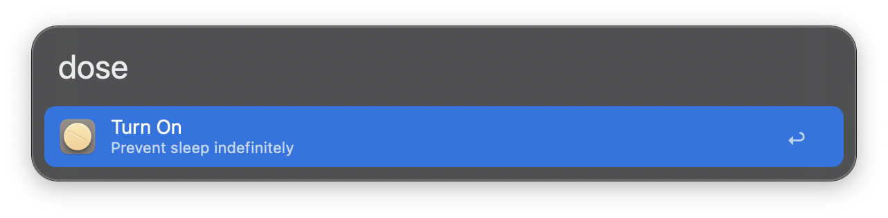
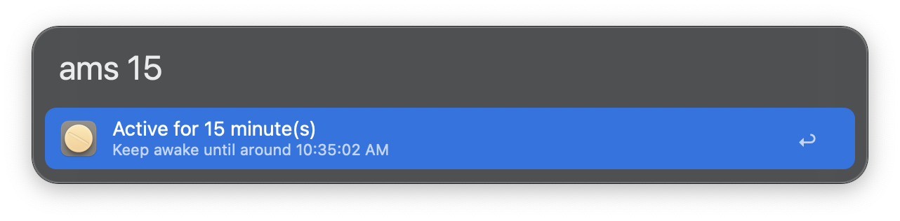

#  Amphetamine Dose | Alfred Workflow

Control the [Amphetamine app](https://apps.apple.com/us/app/amphetamine/id937984704?mt=12) straight from Alfred — start or stop sessions and set how long your Mac should stay awake, all without lifting your hands from the keyboard.

## Download

- Available on the Alfred Gallery. Get it [here](https://alfred.app/workflows/vanstrouble/amphetamine-dose/).
- You can also download it from GitHub [here](https://github.com/vanstrouble/dose-alfred-workflow/releases/latest).

**Not a fan of fancy extras? Go native with _Caffeine Dose_ — it runs on `caffeinate`, no sugar, no cream. Just pure workflow. [Try it here](https://github.com/vanstrouble/caffeine-dose-alfred-workflow.git).**

## Usage

### keep your Mac awake (dose)

Use the `dose` keyword to toggle Amphetamine on or off, preventing macOS from sleeping.

- **Keyword:** `dose`

Hold the **Command (⌘)** key while using the `dose` command, the session will allow the display to sleep.

### One command for everything (ams)

The `ams` command allows you to set Amphetamine to keep your Mac awake for a specific duration or until a specific time. It supports natural input formats for minutes, hours, and specific times, making it flexible and easy to use.

- **Keyword:** `ams [duration or time]`

Hold the **Command (⌘)** key while using the `ams` command, the session will allow the display to sleep.

#### Examples:

| Command    | Description                                    |
|------------|------------------------------------------------|
| `ams i`    | Keeps your Mac awake indefinitely.             |
| `ams 15`   | Keeps your Mac awake for 15 minutes.           |
| `ams 2h`   | Keeps your Mac awake for 2 hours.              |
| `ams 1 30` | Keeps your Mac awake for 1 hour and 30 minutes.|
| `ams 9:30` | Keeps your Mac awake until the next 9:30.      |
| `ams 8am`  | Keeps your Mac awake until 8:00 AM.            |
| `ams 11:40pm` | Keeps your Mac awake until 11:40 PM.        |

The `ams` command supports both 12-hour (AM/PM) and 24-hour time formats.

### Customization

Both `dose` and `ams` commands can be customized in the workflow settings. You can modify their keywords or behavior to better suit your needs.
